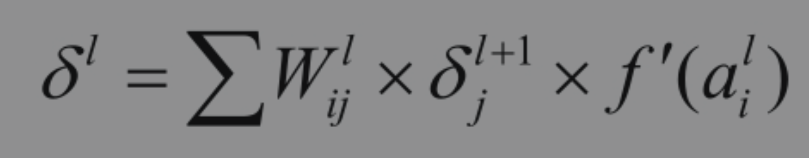

## 简易神经网络算法实现

神经网络算法包含两个部分，前向传播 + 反向传播

前向传播得到预测结果

根据预测结果与真实值的偏差，以反向传播算法更新传播层的权重

整个反向传播算法的核心公式如下



其中
Wij 是上一层的权重系数

δ 是上一层的误差

f`(a) 是本层的激活函数求导

# Layer
根据公式，每一个传播层包含forward(前向传播)与backward(反向传播)

```python
class Layer:
    def __init__(self, dim, cell, activate = 'ReLU', layerNum = 0.5):
        self.layerNum = layerNum
        self.dim = dim
        self.cell = cell
        self.weight = np.random.rand(cell ,dim +1 ) /2 -0.25  ## (10,785)
        self.activate = activate

    def getWeight(self):
        del_col = self.weight.shape[1] - 1
        return np.delete(self.weight, del_col, 1)

    def getOutput(self):
        return self.output

    def forward(self, X):  ## (784,100)
        self.input = self.appendInput(X)  ## (785,100)
        matrix = self.weight.dot(self.input)
        matrix = matrix.T

        if self.activate == 'ReLU':
            active_matrix = np.array([ReLU(row) for row in matrix])
        else:
            active_matrix = np.array([softmax(row) for row in matrix])
        self.output = active_matrix.T
        return self.output

    def appendInput(self, X):
        dim_y = X.shape[1]
        Y = np.random.rand(1, dim_y) - 0.5
        X = np.append(X, Y, 0)
        return X

    def backward(self, delta, weight, learn):
        ## delta (1,100) weight (1,10)  learn 0.1  output (10,100) input (785,100)
        ## self.delta = sigmoid_derivate(output) * (delta.T dot weight) (10,100)
        ## delta_weight = learn * (input dot self.delta)
        ## self.weight = self.weight - delta_weight (10,785)
        output = self.output
        if self.activate == 'ReLU':
            output_derivate = np.array([ReLU_deriv(x) for row in output for x in row])
        else:
            output_derivate = output
        output_derivate = np.reshape(output_derivate, output.shape)  ##(10,100)
        self.delta = output_derivate * weight.T.dot(delta)  ##(10,100)
        batch_size = delta.shape[1]
        delta_weight = self.delta.dot(self.input.T) / batch_size
        self.weight = self.weight + learn * delta_weight
        return self.delta
``` 

# Model
model由layer构建而成，依次layer的forward方法计算预测值，调用layer的backward方法更新layer层的权重
```python
class Model:
    def __init__(self, learn):
        self.learn = learn
        self.layers = []
        self

    def addLayer(self, layer):
        self.layers.append(layer)

    def getLayer(self, index):
        size = len(self.layers)
        if index >= size:
            raise Exception("index out of range")
        return self.layers[index]

    def getLayers(self):
        return self.layers

    def forward(self, X):
        for layer in self.layers:
            X = layer.forward(X)
        self.output = X
        return X

    def backward(self, delta):
        size = delta.shape[0]
        weight = np.diag([1] * size)
        learn = self.learn
        layers = list(reversed(self.layers))
        for layer in layers:
            delta = layer.backward(delta, weight, learn)
            weight = layer.getWeight()
        return
```

# MNIST手写体预测
构造三层神经网络
```python
model = Model(0.05)
layer1 = Layer(784, 100, layerNum=1)
model.addLayer(layer1)
layer2 = Layer(100, 50, layerNum=2)
model.addLayer(layer2)
layer3 = Layer(50, 10, 'softmax', layerNum=3)
model.addLayer(layer3)

```
加载数据集
```python
(x_train, y_train), (x_test, y_test) = mnist.load_data()
```

用训练数据更新model的权重，当准确度超过0.9时，停止循环
```python
for time in range(30):
    accuracy = 0

    for index in range(int(x_train.shape[0] / 100)):
        start = index * 100
        end = (index + 1) * 100
        x = x_train[start: end]
        x = modify_input(x)
        ## 前向传播
        predict = model.forward(x)
        y = y_train[start: end]
        y = one_hot(y)
        layer1 = model.getLayer(0)
        layer2 = model.getLayer(1)
        delta = y - predict
        
        ##反向传播
        model.backward(delta)

        y = get_predicts(y)
        predict = get_predicts(predict)
        new_accuracy = get_accuracy(y, predict)
        accuracy = new_accuracy if new_accuracy > accuracy else accuracy
        print('accuracy', accuracy)

    if (accuracy >= 0.9):
        break
```

以测试数据验证模型准确度
```python
 index = 0

x = x_test[index]
y = y_test[index]
print_image(x)
print(y)
x = modify_input(x)
predict = get_predicts(model.forward(x))
print(predict)

## check batch_size predict accuracy
batch_size = 10000

x_batch = x_test[index:index + batch_size]
x_batch = modify_input(x_batch)
predict_batch = get_predicts(model.forward(x_batch))
y_batch = y_test[index:index + batch_size]

accuracy = get_accuracy(y_batch, predict_batch)
print(accuracy)
```

10000条测试数据得到的准确度是**0.8697**，作为神经网络的简易构建，还不错
